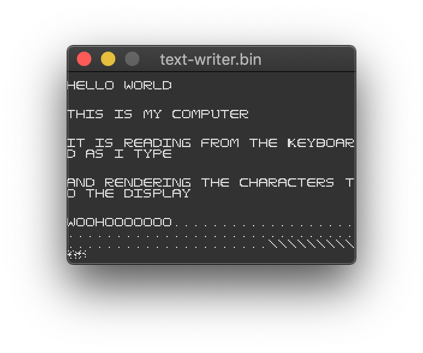

# Simple Computer

Whilst reading [_But How Do It Know?_](http://buthowdoitknow.com/) by J. Clark Scott I felt compelled to write something to simulate the computer the book describes. 

Starting from NAND gates, and moving up through to registers, RAM, the ALU, the control unit and adding I/O support, I eventually ended up with a fully functional machine. 

All the components of the system are based on logic gates and the way they are connected together via the system bus.   



For a write up about this project, see my blog post about it here https://djhworld.github.io/post/2019/05/21/i-dont-know-how-cpus-work-so-i-simulated-one-in-code/

# Specs

- `~0.006mhz` 
  - at least on my machine
- 16-bit 
  - the book describes an 8-bit CPU for simplicity but I wanted more RAM and there is only one system bus
- 65K RAM
- 240x160 screen resolution 
- 4x 16-bit registers (`R0`, `R1`, `R2`, `R3`)

Missing features

- Interrupts, so you have to write awful polling code
  - The book does shortly describe how to extend the system to support interrupts but would involve a lot more wiring 
- Stack pointer register + stack + stack manipulation instructions so nested `CALL` instructions won't work and registers may be left in an inconsistent state
- Hard drive
- Subtract instruction
- `MOV` instruction
- Floating point math (lol)
- Everything else you could think of from a modern CPU

Bonus features

- No Meltdown/SPECTRE risk
- Can easily overwrite any portion of memory without any protective mode getting in the way
- Currently incapable of accessing the internet 
  - I can see how you might write a simple networking I/O adapter, although I'd imagine it would be tedious writing the assembly to get bytes in and out of it 🤔


# Instructions


| Instruction    | Type      | Description   | Example |
| -------------- | --------- | ------------- | ------------- |
| `LOAD Ra, Rb`   | Machine   | Load value of memory address in register A into register B | `LOAD R1, R2` |
| `STORE Ra, Rb`  | Machine   | Store value of register B into memory address in register A | `STORE R3, R1` |
| `DATA Ra, <VALUE>`  | Machine   | Put `<VALUE>`  into register A. `<VALUE>` can either be a symbol, prefixed with `%` (e.g. `%LINE-X`) or a numeric value (e.g. `0x00F2` or `23`)  | `DATA R3, %KEYCODE` |
| `JR Ra`  | Machine   | Jump to instruction in memory address in register A | `JR R2` |
| `JMP <LABEL>`  | Machine   | Jump to instruction in memory address for `<LABEL>` | `JMP startloop` |
| `JMP[CAEZ]+ <LABEL>`  | Machine  | Jump to instruction in memory address for `<LABEL>` if flags register for any combination of `CAEZ` is true | `JMPEZ endloop` |
| `CLF`  | Machine  | Clear contents of flags register | `CLF` |
| `IN <MODE>, Ra`  | Machine  | Request input from IO device to Register A | `IN Data, R3` |
| `OUT <MODE>, Ra`  | Machine  | Send output to IO device for register A | `OUT Addr, R2` |
| `ADD Ra, Rb`   | Machine  | 16 bit addition of two registers | `ADD R0, R2` |
| `SHR Ra`   | Machine  | Shift right register A | `SHR R0` |
| `SHL Ra`   | Machine  | Shift left register A | `SHL R0` |
| `NOT Ra`   | Machine  | Bitwise NOT on register A | `NOT R2` |
| `AND Ra, Rb`   | Machine  | Bitwise AND on two registers | `AND R2, R3` |
| `OR Ra, Rb`   | Machine  | Bitwise OR on two registers | `OR R0, R1` |
| `XOR Ra, Rb`   | Machine  | Bitwise XOR on two registers | `XOR R1, R0` |
| `CMP Ra, Rb`   | Machine  | Compare register A and register B (will set flags register) | `CMP R1, R2` |
| `CALL <LABEL>`   | Pseudo | Call a subroutine. This will jump to the subroutine, on completion, the subroutine should jump back and continue from the next instruction. Note: there is no stack functionality here so all registers may be in a different state at the end of the subroutine. | `CALL pollKeyboard` |

# I/O devices

The following I/O devices are supported by the computer.


| Device | Address |
| -------------- | ------------- | 
| Keyboard |  `0x000F` |
| Display |  `0x0007` |


# Memory layout

There is no memory management unit or protected areas of memory.

However the [assembler](cmd/assembler/) and simulator will start executing user code from offset `0x0500`

# Assembler

Machine code can be written in text and assembled using a crude assembler I wrote.

See [assembler](cmd/assembler/) for more information.

# Building

Requirements

* go 1.12+
* GLFW 3.2+


Building:

```
make
```

There are some unit tests that take 30-45 seconds to run through, by running 

```
make test
```

# Running

The computer can be run using the wrapper tool I wrote that utilises GLFW for I/O functionality.

Example of running the `brush.bin` program

```
./bin/simulator -bin _programs/brush.bin
```


# Example programs

You can see some example programs I wrote under [_programs/](/_programs/), note the ASM code I wrote for these is very bad and I lost my sanity a bit when writing them.


# Why bother? 

I'm taking myself on a journey, a hardware journey you might say. I want to understand how computers work at a lower level but not quite low enough for the physics/digital electronics side of things. 

Just enough to see all the pieces of the system interacting. I remember doing a lot of this stuff in school but I'd say my education seemed to focus on the concepts (Von-Neumann architecture, fetch-decode-execute) rather than the actual construction of a CPU. 

This simple computer is the start of that journey, it's actually been a very rewarding little project.

I hope to move onto playing around with X86/ARM/RISC-V next although I suspect it will be quite a leap (of faith)

